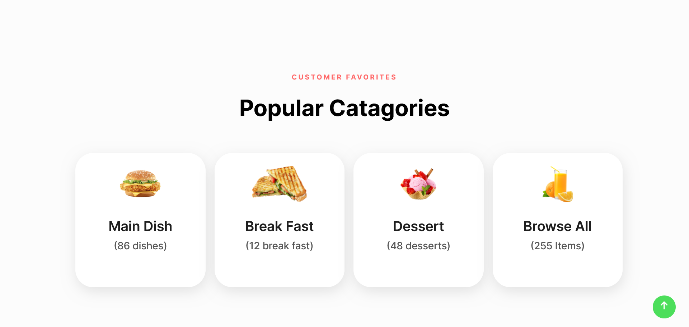
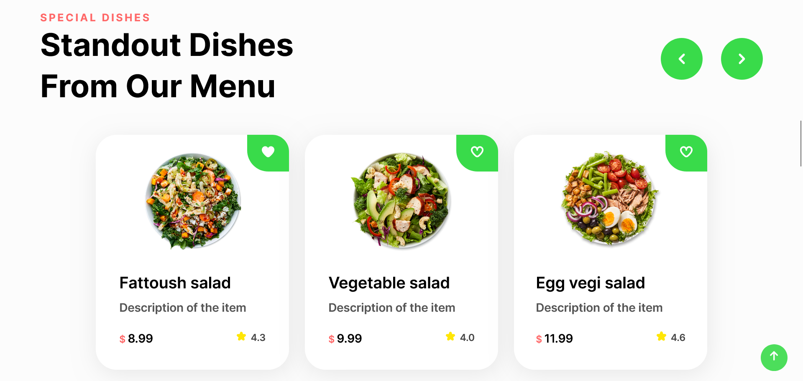
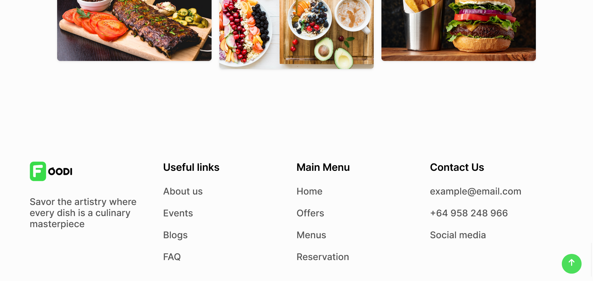
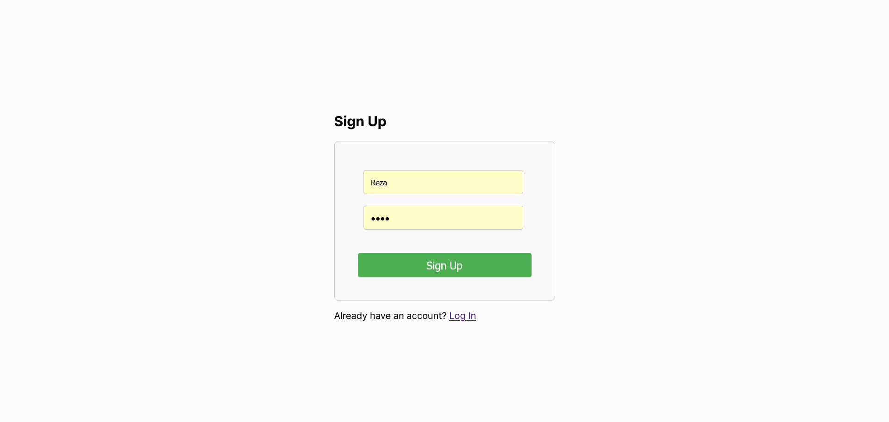

# Project Title

Foodi | Food ordering site
## Features

- Online ordshes as well as popular ones
- Catering 
- Option to use gift card

## Screenshots

## Setup

1. Install XAMPP or WAMPP.
2. Open XAMPP Control panel and start {apache} and [mysql]
3. Download project from github (https://github.com/Rezansrv/Foodi)
OR follow gitbash commands 

i>cd C:\xampp\htdocs\

ii>git clone
git@github.com:Rezansrv/Foodi.git

4. extract files in C:\xampp\htdocs.

5. open link localhost/phpmyadmin

6. click on new at side navbar.

7. give a database name as (news-project) hit on create button.

8. after creating database name click on import.

9. browse the file in directory [./database/foodi.sql].

10. after importing successfully.

11. open any browser and type http://localhost/phpmyadmin/foodi.html

12. first register and then login

## Usage

You can use the features and options available in the website to choose and order your desired goods.

## Contributing

If you would like to contribute to the project, please read the [CONTRIBUTING.md](CONTRIBUTING.md) file.

## Issues

If you encounter any issues, please create a report on the [Issues page](https://github.com/rezansrv/Foodi/issues).

## License

This project is licensed under the The MIT License (MIT).